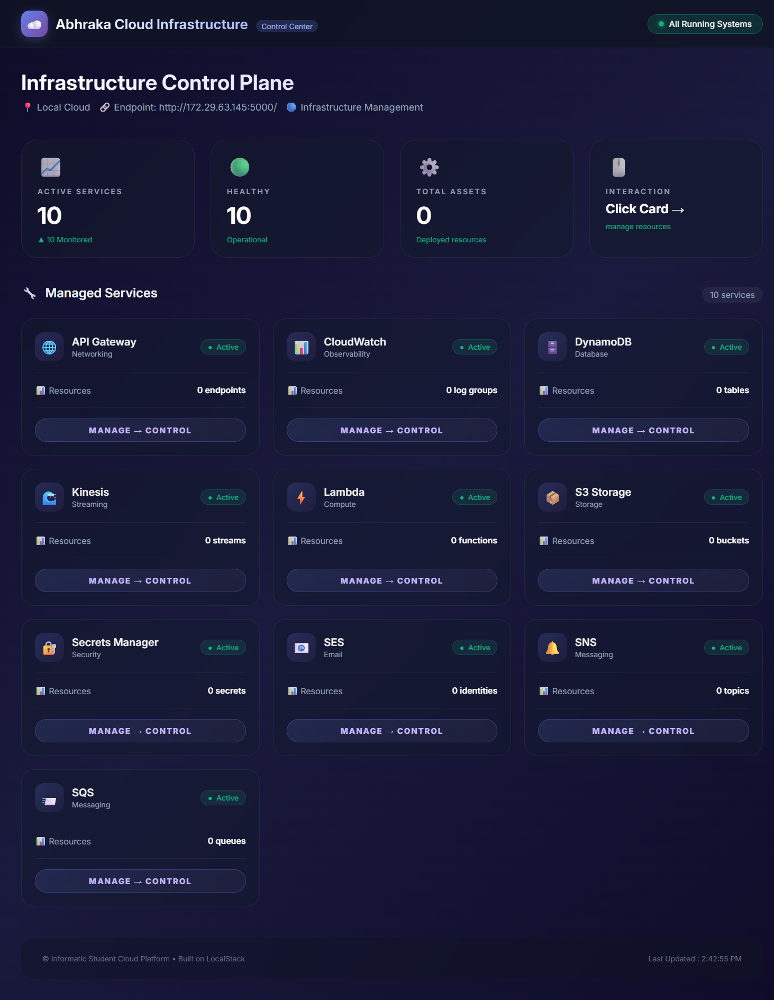

<p align="center">
  
  
  
  
  
</p>

<h1 align="center">
  ☁️ Abhraka Cloud Platform
  <br>
  <sub>Enterprise Cloud Infrastructure Management Dashboard</sub>
</h1>

<p align="center">
  A production-ready cloud infrastructure dashboard that manages <strong>10 AWS services</strong>
  running on <strong>LocalStack</strong> emulator. Built with modern design patterns and 
  enterprise-grade architecture.
</p>

---

## Table of Contents

<table>
  <tr>
    <td width="50%">
      <ul>
        <li><a href="#-features"> Features</a></li>
        <li><a href="#-architecture"> Architecture</a></li>
        <li><a href="#-quick-start"> Quick Start</a></li>
        <li><a href="#-service-matrix"> Service Matrix</a></li>
        <li><a href="#-technology-stack"> Technology Stack</a></li>
      </ul>
    </td>
    <td width="50%">
      <ul>
        <li><a href="#-project-structure"> Project Structure</a></li>
        <li><a href="#-configuration"> Configuration</a></li>
        <li><a href="#-monitoring"> Monitoring</a></li>
        <li><a href="#-contributing"> Contributing</a></li>
        <li><a href="#-license"> License</a></li>
      </ul>
    </td>
  </tr>
</table>

---

## Features

### Core Capabilities

| Category 	      |		        	 Features 		 |
|---------------------|--------------------------------------------------|
| **Storage** 	      | S3 bucket management, file upload/download       |
| **Compute** 	      | Lambda function invocation, serverless execution |
| **Database** 	      | DynamoDB table operations, CRUD actions          |
| **Messaging**       | SQS queue messages, SNS topic notifications      |
| **Networking**      | API Gateway REST API creation and testing        |
| **Observability**   | CloudWatch logs, metrics collection              |
| **Security** 	      | Secrets Manager credential storage               |
| **Streaming**       | Kinesis data stream management                   |
| **Email**           | SES email simulation                             |

### Interactive Dashboard

-  **Glassmorphism UI** with modern design language
-  **Click-to-manage** interface for all services
-  **Real-time metrics** with auto-refresh (15s interval)
-  **Dark theme** optimized for cloud professionals
-  **Fully responsive** for desktop and tablet

---

## Architecture
- User Browser: http://localhost:5000 
- Flask Web Server (Dashboard UI)
- boto3 AWS SDK (Service API Calls)
- LocalStack Container: S3-SQS-SNS-DB-Lambda-API-CW-Kinesis-SES-SM
- Docker Desktop (Container Runtime)

---

## Quick Start

### Prerequisites

|   Requirement  |Version | 	    Installation           |
|----------------|--------|--------------------------------|
| Docker Desktop | 24.0+  | [Download](https://docker.com) |
| Python         | 3.12+  | [Download](https://python.org) |
| LocalStack 	 | Latest | `pipx install localstack`      |
| AWS CLI Local  | Latest | `pipx install awscli-local`    |

### Installation Steps

**1. Clone the Repository**
```bash
git clone https://github.com/Alfid/abhraka-cloud-dashboard.git
cd abhraka-cloud-dashboard

# Setup virtual environment
python3 -m venv venv
source myenv/bin/activate

# Install dependencies
pip install -r requirements.txt

# Configure LocalStack Authentication
**Register at https://app.localstack.cloud**
export LOCALSTACK_AUTH_TOKEN="your-token-here"

# Start LocalStack
localstack start

# Run dashboard
python src/monitor.py

#Access Dashboard
http://localhost:5000
```


### 🖥️ Dashboard Preview



*Dashboard utama dengan glassmorphism UI*

---

## Service Matrix
Berikut adalah 10 layanan AWS yang telah diimplementasikan dalam dashboard ini:

###	Service	Category		Operations		Status
1.	S3				Storage			Upload files, List buckets		              ✅
2.	API Gateway			Networking		Create REST APIs, Test endpoints	  ✅
3.	DynamoDB			Database		Create tables, Put items, Scan		      ✅
4.	SQS				Messaging		Create queues, Send messages		            ✅
5.	CloudWatch			Observability		Create log groups, View streams		✅
6.	Secrets Manager			Security		Store secrets, Retrieve values		✅
7.	SNS				Messaging		Create topics, Publish notifications	      ✅
8.	Lambda				Compute			Create functions, Invoke		            ✅
9.	Kinesis				Streaming		Create streams, Put records		          ✅
10.	SES				Email			Send simulated emails			                    ✅

### Service Status Legend
- Icon	Meaning
- ✅		Fully implemented & tested
- 🟡		Partially implemented

##  Technology Stack
Backend
Technology		Purpose
Python 3.12		Core programming language
Flask			Web framework
boto3			AWS SDK for Python
LocalStack 		AWS cloud emulator
Frontend
Technology		Purpose
HTML5			Structure
CSS3			Styling with Glassmorphism
JavaScript (ES6)	Interactivity
Google Fonts (Inter)	Typography
DevOps
Tool			Purpose
Docker			Containerization
Git			Version control
pip			Package management

### 📁 Project Structure
```abhraka-cloud-dashboard/
├── src/
│   ├── __init__.py
│   └── monitor.py      	     # Main application
├── docs/
│   └── user-manual.md              # User documentation
├── scripts/
│   └── setup.sh                    # Setup script
├── tests/
│   └── test_services.py            # Unit tests
├── configs/
│   └── localstack-config.yml       # LocalStack config
├── .github/
│   └── workflows/
│       └── ci.yml                  # CI/CD pipeline
├── requirements.txt                # Python dependencies
├── .env.example                    # Environment template
├── .gitignore                      # Git ignore rules
├── LICENSE                         # MIT License
├── Dockerfile                      # Docker configuration
├── docker-compose.yml              # Multi-container setup
└── README.md                       # This file
```

### Configuration
```
Environment Variables
Create a .env file:
```
### LocalStack Configuration
```
LOCALSTACK_ENDPOINT=http://localhost:4566
LOCALSTACK_AUTH_TOKEN=your-token-here
AWS_REGION=us-east-1
```
### Dashboard Configuration
```
DASHBOARD_PORT=5000
DASHBOARD_HOST=0.0.0.0
REFRESH_INTERVAL=15
```

### Debug Mode
```
DEBUG=false
```

### LocalStack Service Configuration
### docker-compose.yml
```
version: '3.8'
services:
  localstack:
    image: localstack/localstack:latest
    ports:
      - "4566:4566"
    environment:
      - SERVICES=s3,sqs,sns,dynamodb,lambda,apigateway,cloudwatch,kinesis,ses,secretsmanager
      - DEBUG=1
    volumes:
      - ./localstack_data:/var/lib/localstack
```

## 📈 Monitoring
Dashboard Metrics
The dashboard provides real-time monitoring of:
- Total Services: 10 active AWS services
- Operational Status: Health checks for each service
- Active Resources: Buckets, queues, tables, functions, secrets
- Auto-refresh: Updates every 15 seconds

Health Check Endpoint
curl http://localhost:5000/health

## Contributing
We welcome contributions! Please see our Contributing Guide.

Development Workflow
1. Fork the repository
2. Create a feature branch: git checkout -b feature/amazing-feature
3. Commit changes: git commit -m 'Add amazing feature'
4. Push: git push origin feature/amazing-feature
5. Open a Pull Request

## 📄 License
This project is licensed under the MIT License - see the LICENSE file for details.

## Academic 	Information
 - Information	Details
 - Course		Cloud Computing
 - Student		Dimas Alfiansyah (alfid814)
 - Assignment	Implementation of Cloud Emulator with 10 AWS Services
 - Institution	Sultan Agung Islamic University
<p align="center"> Built with ☁️ and 🌐 by Dimas Alfiansyah <br> <sub>Abhraka Cloud Platform - Infrastructure Control Center</sub> </p>
